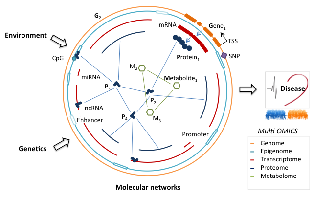

# Welcome to the Heinig lab

## Overview

The [Heinig lab](https://www.helmholtz-munich.de/icb/research/groups/genetic-and-epigenetic-gene-regulation/projects/index.html) is located at the [Insitiute of Computational Biology](https://comp.bio), which is part of the [Computational Health Center](https://www.helmholtz-munich.de/computational-health-center/) of [Helmholtz Munich](https://www.helmholtz-munich.de/).

Technological advances allow for an unprecedented in-depth characterization of the molecular basis of complex diseases. In particular SNP genotyping, DNA methylation assays and gene expression profiling in large cohorts have been used to identify numerous disease associated loci and genes. However, a deeper mechanistic or systems level understanding of disease processes still remains elusive in most cases.

The aim of our research is the development and application of computational and statistical tools for the identification of molecular regulatory networks underlying common diseases and the genetic and epigenetic mechanisms controlling these networks from population level DNA and multi-omics data sets. A special focus is the molecular characterization of metabolic and cardiovascular diseases, in particular diabetes and arrhythmias like atrial or ventricular fibrillation.

## Projects

### Using natural genetic and epigenetic variation to characterize regulatory networks underlying complex diseases

Motivated by the fact that most disease associated variants identified to date are located in non-coding parts of the genome, which likely harbors regulatory elements, we are studying the effect of naturally occurring sequence variation on gene regulation. To characterize regulatory sequence variants two related challenges have to be met: 1) regulatory elements have to be recognized and 2) the corresponding target genes have to be identified. Epigenetic marks such as histone modifications have proved instrumental for the identification of regulatory elements in the genome, while the integrated analysis of genetic variation and gene expression provides a strategy (expression QTL mapping) to identify targets of regulatory variants. Ultimately the integration of genetic, genomic and epigenomic data set is expected to lead to a comprehensive understanding of regulatory sequence variation and its role in disease. Towards these goals we have:

- developed the computational tool [sTRAP](http://trap.molgen.mpg.de/cgi-bin/home.cgi) for the identification of causative cis regulatory variants affecting transcription factor binding [(Manke*, Heinig* Hum Mutat 2010)](https://pubmed.ncbi.nlm.nih.gov/20127973/) and successfully applied this tool in a disease gene study [(Monti Nat Genet 2008)](https://pubmed.ncbi.nlm.nih.gov/18443590/) for heart failure,
- developed a statistical approach for the identification of a transcription factor driven regulatory network, including its master regulator and the interpretation of disease association (type 1 diabetes) using this regulatory network [(Heinig Nature 2010)](https://pubmed.ncbi.nlm.nih.gov/20827270/),
- performed an integrated analysis of the consequences of genetic variation for multiple levels of epigenetic and transcriptional regulation [(Rintisch*, Heinig* Genome Res 2014)](https://pubmed.ncbi.nlm.nih.gov/24793478/),
- developed the computational tool [histoneHMM](https://github.com/matthiasheinig/histoneHMM) for the identification of differentially modified regions for histone modifications with broad genomic footprints [(Heinig BMC Bioinformatics 2015)](https://pubmed.ncbi.nlm.nih.gov/25884684/).
 developed predictive models to identify functional genomic elements predictive of regulatory variants [(Budach, Heinig* and Marsico* Genetics 2016)](https://academic.oup.com/genetics/article/203/4/1629/6065860)
- performed one of the largest eQTL studies to date in the human heart [(Heinig Genome Biology 2017)](https://genomebiology.biomedcentral.com/articles/10.1186/s13059-017-1286-z)

### Regulatory networks and computational systems biology of atrial fibrillation

Atrial fibrillation is the most common form of arrhythmia. It leads to a fivefold increase in the risk of stroke and thus constitutes a major health burden. Within the SymAtrial junior research alliance, we are characterizing the molecular pathways and regulatory mechanisms involved in disease aetiology and progression by using integrative data analysis and multilevel modelling. In particular we will:

- Identify deregulated key transcription factors and their target genes using differential expression results in a case control setup.
- Identify posttranscriptional regulatory mechanisms using integrated analysis of deregulated miRNAs and their mRNA and protein targets. 
- Identify candidate causal variants for published and novel GWA loci using heart eQTL data, DNA methylation data and publicly available chromatin data in conjunction with computational sequence analysis.
- Integrate the components of the AF associated regulatory networks, relate them to metabolite concentrations and translate results to potential blood-based omics markers.

### Publications

[Visit google scholar](https://scholar.google.com/citations?user=Is48SCoAAAAJ&hl=en) for a full list of publications.

**Selected publications:**
1. Hawe JS*, Wilson R*, Schmid KT*, Zhou L, Lakshmanan LN, Lehne BC, Kühnel B, Scott WR, Wielscher M, Yew YW, Baumbach C, Lee DP, Marouli E, Bernard M, Pfeiffer L, Matías-García PR, Autio MI, Bourgeois S, Herder C, Karhunen V, Meitinger T, Prokisch H, Rathmann W, Roden M, Sebert S, Shin J, Strauch K, Zhang W, Tan WLW, Hauck SM, Merl-Pham J, Grallert H, Barbosa EGV; MuTHER Consortium, Illig T, Peters A, Paus T, Pausova Z, Deloukas P, Foo RSY, Jarvelin MR, Kooner JS, Loh M†, Heinig M†, Gieger C†, Waldenberger M†, Chambers JC†. Genetic variation influencing DNA methylation provides insights into molecular mechanisms regulating genomic function. Nat Genet. 2022;54(1):18-29
2. Schmid KT, Höllbacher B, Cruceanu C, Böttcher A, Lickert H, Binder EB, Theis FJ, Heinig M. scPower accelerates and optimizes the design of multi-sample single cell transcriptomic studies. Nat Commun. 2021 Nov 16;12(1):6625.
3. Assum I*, Krause J*, Scheinhardt MO, Müller C, Hammer E, Börschel CS, Völker U, Conradi L, Geelhoed B, Zeller T, Schnabel RB†, Heinig M†. Tissue-specific multi-omics analysis of atrial fibrillation. Nat Commun. 2022 Jan 21;13(1):441. 
4. Heinig M*, Petretto E*, Wallace C, Bottolo L, Rotival M, Lu H, Li Y, Sarwar R, Langley SR, Bauerfeind A, Hummel O, Lee YA, Paskas S, Rintisch C, Saar K, Cooper J, Buchan R, Gray EE, Cyster JG; Cardiogenics Consortium, Erdmann J, Hengstenberg C, Maouche S, Ouwehand WH, Rice CM, Samani NJ, Schunkert H, Goodall AH, Schulz H, Roider HG, Vingron M, Blankenberg S, Munzel T, Zeller T, Szymczak S, Ziegler A, Tiret L, Smyth DJ, Pravenec M, Aitman TJ, Cambien F, Clayton D, Todd JA, Hubner N, Cook SA. A trans-acting locus regulates an anti-viral expression network and type 1 diabetes risk. Nature. 2010; 467(7314):460-4 ‡
5. Litvinukova M, Talavera-Lopez C, Maatz H, Reichart D, Worth CL, Lindberg EL, Kanda M, Polanski K, Fasouli ES, Samari S, Roberts K, Tuck E, ​Heinig M​, DeLaughter D, McDonough B, Wakimoto H, Gorham JM, Nadelmann E, Mahbubani KT, Saeb-Parsy K, Patone G, Boyle JJ, Zhang H, Zhang H, Viveiros A, Oudit G, Bayraktar O, Seidman JG, Seidman C, Noseda M, Hubner N, Teichmann SA. Cells and gene expression programs in the adult human heart. Nature. 2020; 588;466 ‡
6. van der Wijst M, de Vries DH, Groot HE, Trynka G, Hon CC, Bonder MJ, Stegle O, Nawijn MC, Idaghdour Y, van der Harst P, Ye CJ, Powell J, Theis FJ, Mahfouz A, ​Heinig M​, Franke L. The single-cell eQTLGen consortium. ​Elife​. 2020;9:e52155
7. Manke T*, Heinig M*, and Vingron M. Quantifying the effect of sequence variation on regulatory interactions. Hum Mutat. 2010; 31(4):477-83  ‡
8. Budach S, Heinig M*, Marsico A*. Principles of microRNA Regulation Revealed Through Modeling microRNA Expression Quantitative Trait Loci. Genetics. 2016; pii: genetics.116.187153
9. Heinig M*, Adriaens ME*, Schafer S*, van Deutekom HWM, Lodder EM, Ware JS, Schneider V, Felkin LE, Creemers EE, Meder M, Katus HA, Rühle F, Stoll M, Cambien F, Villard E, Charron P, Varro A, Bishopric NH, George Jr. AL, dos Remedios C, Moreno Moral A, Pesce F, Bauerfeind A, Rüschendorf F, Rintisch C, Petretto E, Barton PJ, Cook SA, Pinto Y, Bezzina CR, Hubner N. Natural genetic variation of the cardiac transcriptome in non-diseased donors and patients with dilated cardiomyopathy. Genome Biology. 2017; 18(1);170 ‡
10. Rintisch C*, Heinig M*, Bauerfeind A, Schafer S, Mieth C, Patone G, Hummel O, Chen W, Cook S, Cuppen E, Colome-Tatche M, Johannes F, Jansen RC, Neil H, Werner M, Pravenec M, Vingron M, and Hubner N. Natural variation of histone modification and its impact on gene expression in the rat genome. Genome Res. 2014; 24(6):942-53 ‡

